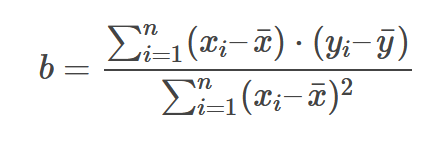
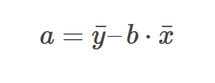
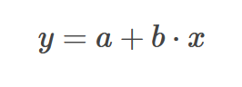

LRD

<u>
Datenhaltung mit NumPy in Matrizen.
</u>

-------------------------

<a style="margin-left: 20px; color: #FFF; width: 92%; background-color: #221; margin-top: 10px; margin-right: 20%; padding-left: 20px; padding-right: 20px; font-size: 18pt;" href="https://github.com/jannikwiessler/pythonDHBW/blob/main/Lineare_Regression/Lineare_Regression_py.pptx">Erklärung des LRD</a>
 

    </img>
    </img>
    </img>

-------------------------

MATRIX 

   

      Dimension 1
         <table width="33%" border = "3">
            <tr>
               <td>0</td>
               <td>1</td>
            </tr>
            <tr>
               <td>input: x</td>
               <td>input: y</td>
            </tr>
         </table>
   

   

   Dimension 2
      <table width="33%" border = "3">
         <tr>
            <td>0</td>
            <td>1</td>
         </tr>
         <tr>
            <td>summe: x</td>
            <td>summe: y</td>
         </tr>
      </table>
   

   

   Dimension 3
      <table width="33%" border = "3">
         <tr>
            <td>0</td>
            <td>1</td>
         </tr>
         <tr>
            <td>Zähler</td>
            <td>Nenner</td>
         </tr>
      </table>
   

