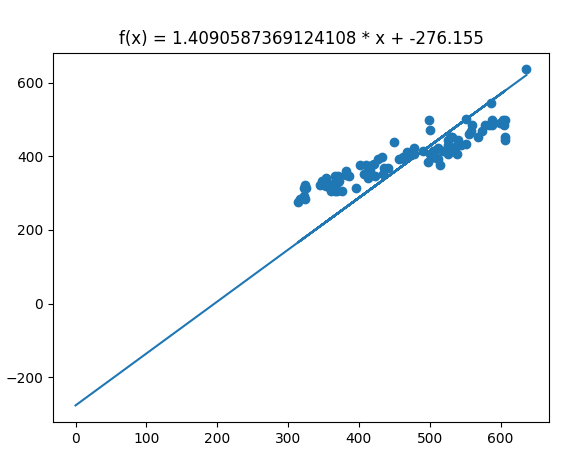

# LRD
### trial_and_error
----------------

 

Das Programm probiert alle möglichen Graden durch und gibt am Ende die zurück,
die den kleinsten Abstand zu den Punkten hat.

 

<table style="border-color: #FFF; border: 2", width="100%">
    <tr>
        <td>Ergebnis nach Excel wäre</td>
        <td>f(x) = 0.6869166 * x +  76.89601688</td>
    </tr>
    <tr>
        <td>Hier kommt</td>
        <td>f(x) = 1.4090587 * x + -276.155</td>
    </tr>
</table>
  
</img>
