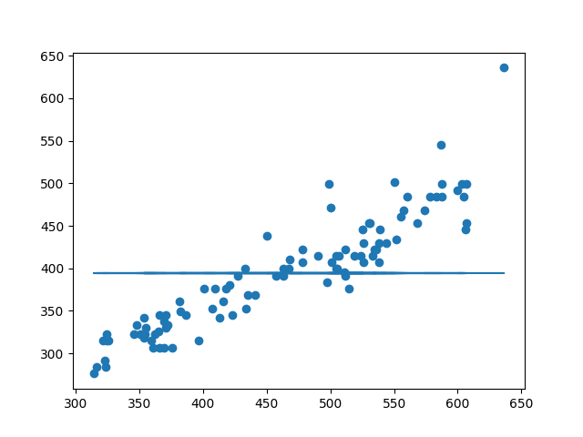

# LRD

-------------------------

### Hier gibt es eine Datenhaltung in Tabellen und nicht in Objekten.
 

<a style="color: #00AA00; width: 92%;border-radius: 40px;background-color: #221; height: px;text-decoration: none;font-weight: normal;margin-top: 10px; margin-right: 20%; padding-left: 20px; padding-right: 20px; font-size: 18pt;" href="https://github.com/jannikwiessler/pythonDHBW/blob/main/Lineare_Regression/Lineare_Regression_py.pptx">Erklaerung des LRD</a>
 

-------------------------

MATRIX 
<table width="100%" style="margin-left: 20px;" border="1" bordercolor="#232323" bgcolor="#121212" cellpadding="0" cellspacing="2">
 <tr>
  <td>Index</td>
  <td>0</td>
  <td>1</td>
  <td>2</td>
  <td>3</td>
  <td>4</td>
  <td>5</td>
  <td>6</td>
  <td>7</td>
  <td>8</td>
  <td>9</td>
  <td>10</td>
  <td>11</td>
 </tr>
 <tr>
  <td>Name</td>
  <td>index</td>
  <td>x    = feature</td>
  <td>g(x) = target</td>
  <td>a</td>
  <td>d</td>
  <td>gd = ∑ ( d )</td>
  <td>f(x) = a * x + b</td>
  <td>d = ∑ ( f(x) - g(x) )</td>
  <td> | g(x) | </td>
  <td>x graph</td>
  <td>y graph</td>
  <td>Kurzeitspeicher</td>
 </tr>
</table>

-------------------------     

 

Zuerst wird der richtige y-Achsen-Abschnitt gesucht.

  
